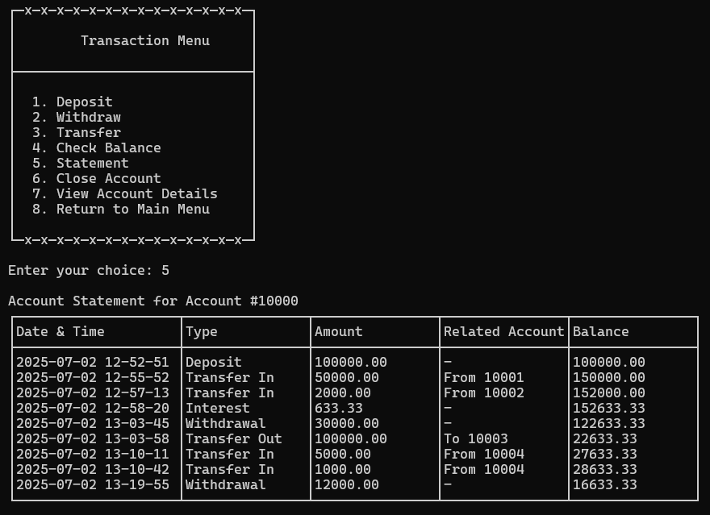
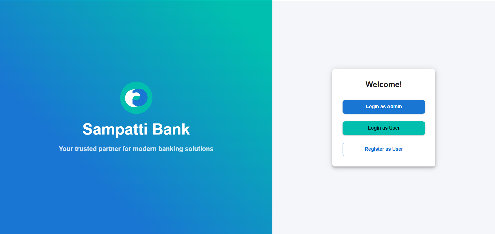
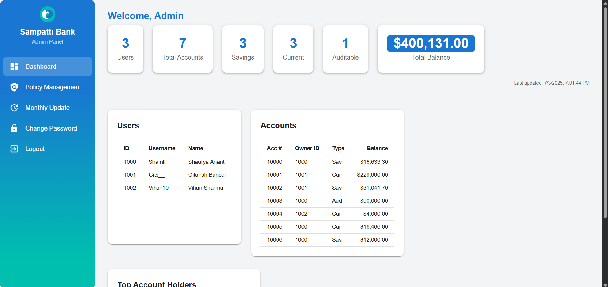
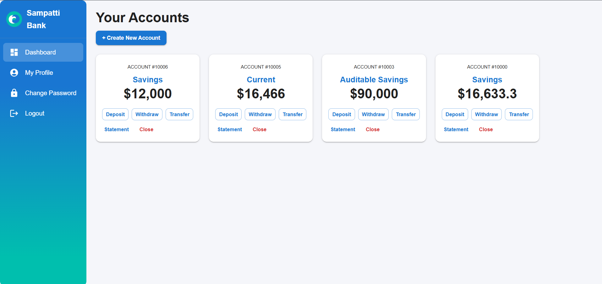
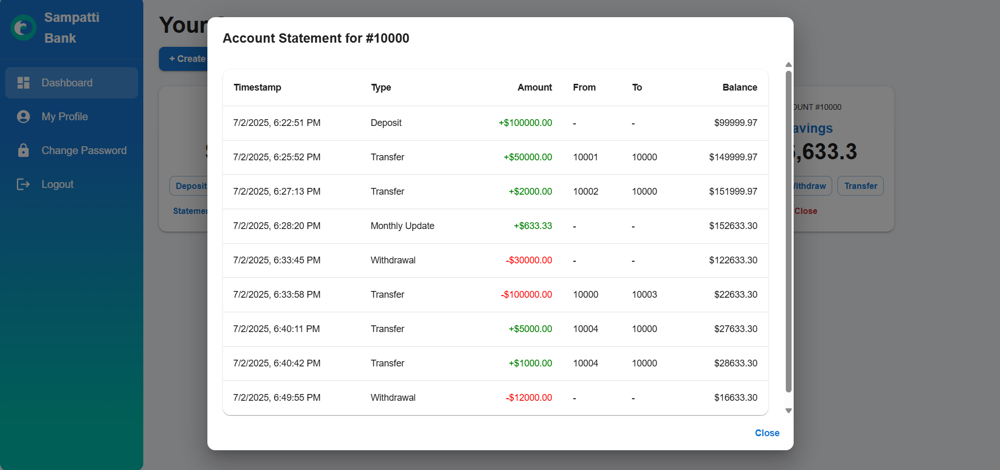

# Sampatti Bank - Bank Management System

---

## 🚀 Live Deployment

- **Frontend (React App):** [http://4.213.156.111:3000](http://4.213.156.111:3000)
- **Backend (API):** [http://4.213.156.111:9080/ping](http://4.213.156.111:9080/ping)

> _Note: These are public demo deployments running on Azure. For security, do not use real credentials._

---

## Project Overview

- **Standalone Console Application:**
  - Written in C++ (see `core/`, `src/`, `Makefile`).
  - Demonstrates OOP principles and banking logic.
- **Full Stack Web Application:**
  - **Backend:** Node.js server (`src/server.js`) with a native C++ addon (`cpp-addon/`).
  - **Frontend:** Modern React app (`bank-frontend/`) for users and admins.

---

## Features

### Standalone Console Application

- **Customer Registration & Login**
  - Secure registration with username, password, and phone validation.
  - Login with authentication and password protection.

- **Account Management**
  - Multiple account types: Savings, Current, Auditable Savings.
  - Create, select, and list accounts for each customer.
  - Password-protected accounts.

- **Transactions**
  - Deposit, Withdraw, and Transfer funds between accounts.
  - Transaction history and account statements.
  - Auditable accounts with detailed logs.

- **Account Closure**
  - Close accounts with options to withdraw or transfer remaining balance.
  - Final statement generation.

- **Persistence**
  - All data (customers, accounts, transactions) is saved and loaded from files.
  - Data directory structure for easy management.

### Full Stack Web Application

- **Modern User Interface**
  - Responsive React frontend for users and admins.
  - Landing page with role-based login and registration.

- **User Features**
  - Register and login as a user.
  - View and manage multiple accounts (Savings, Current, Auditable Savings).
  - Create new accounts with PIN protection.
  - Deposit, withdraw, and transfer funds between accounts.
  - View transaction history and account statements.
  - Change password and view profile details.
  - Close accounts securely.
  - Logout functionality.

- **Admin Features**
  - Admin login and password management.
  - Dashboard with user and account statistics.
  - View all users and all accounts in the system.
  - Manage bank policies (interest rates, fees, etc.).
  - Apply monthly updates (e.g., interest, fees) to all accounts.

- **Secure API**
  - Node.js Express server exposes RESTful endpoints.
  - C++ addon handles core banking logic for performance and security.

---

## Project Structure

```
Bank-Management-System/
│
├── core/             # C++ core banking logic (OOP, business rules, headers & implementations)
├── cpp-addon/        # Node.js native addon (C++ <-> JS bridge, binding code, binding.gyp)
├── bank-frontend/    # React frontend (user/admin dashboards, static assets)
│   ├── public/       # Static files for frontend
│   └── src/          # React source code (components, pages, API)
├── src/              # Main entry points (server.js for backend API, main.cpp for C++ app)
├── data/             # Data persistence (created at runtime, e.g., user/account/transaction files)
├── Makefile          # Build instructions for C++ standalone app
├── package.json      # Backend dependencies and scripts (root)
├── README.md         # Project documentation
└── ...               # Other config and lock files
```

---

## How to Build & Run

### 1. Standalone Console Application (C++)

1. **Build the project:**
   ```sh
   make
   ```
2. **Run the application:**
   ```sh
   make run
   ```

---

### 2. Full Stack Web Application

#### **Install All Dependencies (Recommended)**
From the project root, run:
```sh
npm run install-all
```
This will install all dependencies for the backend, C++ addon, and frontend in one step.

- If you do **not** use `npm run install-all`, you must install dependencies in each part manually:
  ```sh
  # In project root (for backend)
  npm install
  # In cpp-addon (for C++ Node addon)
  cd cpp-addon
  npm install
  cd ..
  # In bank-frontend (for React frontend)
  cd bank-frontend
  npm install
  cd ..
  ```

#### **Build the C++ Addon**

```sh
cd cpp-addon
npm run build   # or: node-gyp configure build
cd ..
```
This will produce `build/Release/bankaddon.node` required by the backend.

#### **Start the Backend Server**
```sh
node src/server.js
```
- The backend will run on **port 9080** by default.
- Access API endpoints at: `http://localhost:9080` or your public IP (e.g., `http://4.213.156.111:9080`)

#### **Start the Frontend**
```sh
cd bank-frontend
npm run dev
```
- The frontend will run on **port 5173** by default (Vite dev server), or **port 3000** in production (`serve dist 3000`).
- Access the app at: `http://localhost:5173` (dev) or `http://4.213.156.111:3000` (public demo)

---

## Admin Default Credentials (For Testing)

- **Username:** `admin`
- **Password:** `admin123`

Use these credentials to log in as an admin for testing purposes in both the console and web applications.

---

## OOP Principles Demonstrated (C++ Core)

- **Encapsulation:**  All data members are private/protected. Access is provided via public methods. Validation is enforced in constructors and setters.
- **Abstraction:**  Abstract base classes (`Account`, `ITransaction`) define interfaces for accounts and transactions. Concrete classes implement specific behaviors.
- **Inheritance:**  `SavingsAccount`, `CurrentAccount`, and `AuditableSavingsAccount` inherit from `Account`. `Deposit`, `Withdrawal`, and `Transfer` inherit from `ITransaction`.
- **Polymorphism:**  Transactions are handled via pointers/references to `ITransaction`. Account operations use virtual and pure virtual methods for deposit, withdraw, and interest calculation.
- **Virtual Methods & Pure Virtual Methods:**  The `Account` and `ITransaction` classes declare virtual and pure virtual methods, enabling runtime polymorphism and enforcing interface contracts for derived classes.
- **Composition:**  `Customer` contains a list of `Account` objects. `Account` can contain a list of `ITransaction` objects (transaction history).
- **Singleton Pattern:**  `Database` and `BankApp` are implemented as singletons to ensure a single point of access.

---


## Application Screenshots

### Console Application

Screenshots from the C++ standalone console application:

#### Main Menu:
  
#### Admin Menu:
  
#### Customer Menu:
  
#### Transaction Menu:
  

### Web Application

Screenshots from the modern React web application:

#### Landing Page:
  
#### Admin Dashboard:
  
#### User Dashboard:
  
#### Bank Statement:
  

---


## Tech Stack

- **C++**: Core banking logic, OOP implementation, file-based persistence
- **Node.js**: Backend runtime for API server and native addon integration
- **Express**: RESTful API server for frontend-backend communication
- **node-gyp**: Build tool for compiling C++ addon for Node.js
- **React**: Frontend library for building user/admin dashboards
- **Vite**: Frontend build tool and dev server
- **Material UI**: UI component library for React
- **JavaScript/ES6+**: Frontend and backend scripting
- **Make**: Build automation for C++ standalone app
- **Other Tools**: ESLint, Babel, etc. (see respective package.json files)

---

## Utilities & Validation

- Input validation for all user data (names, phone numbers, usernames, passwords).
- Password protection for both customer and account access.
- Safe input handling to prevent invalid or malicious entries.

---

## Contributors

- Shaurya Anant
- Gitansh Bansal

---


